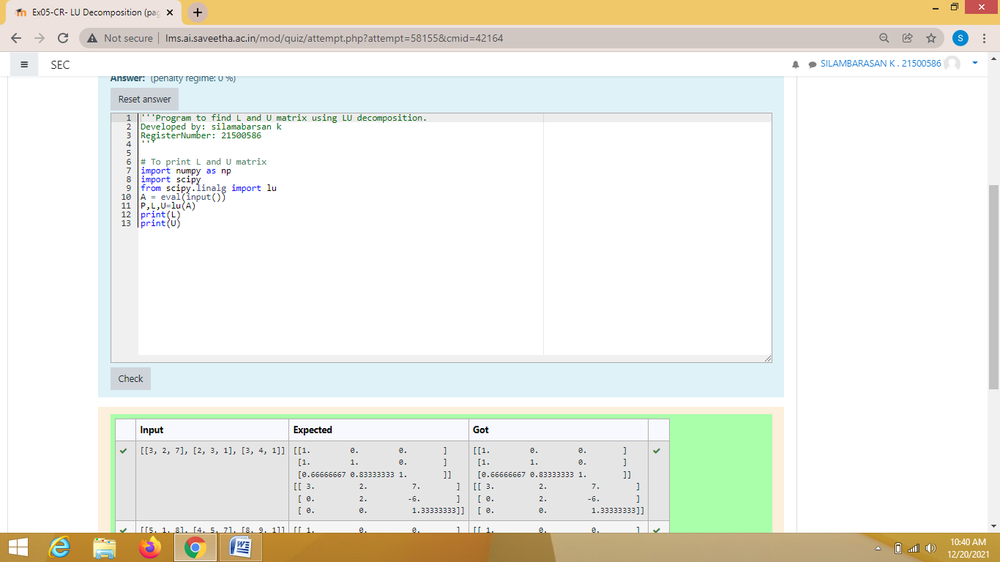
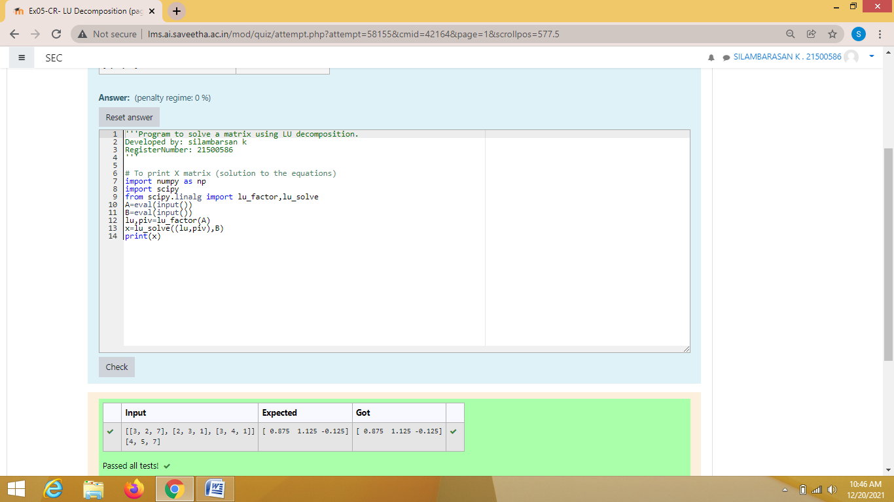

# LU Decomposition without zero on the diagonal

## AIM:
To write a program to find the LU Decomposition of a matrix.

## Equipments Required:
1. Hardware – PCs
2. Anaconda – Python 3.7 Installation / Moodle-Code Runner

## Algorithm
1. import numpy as np
2. From scipy package import lu
3. Get input from user
4. print result
## Program:
```
/*
Program to find the LU Decomposition of a matrix.
Developed by:silamabarsan k 
RegisterNumber: 21500586
import numpy as np
import scipy 
from scipy.linalg import lu
A = eval(input())
P,L,U=lu(A)
print(L)
print(U)
*/
```
```
/*
Program to find the LU Decomposition of a matrix.
Developed by:silamabarsan k 
RegisterNumber: 21500586
import numpy as np
import scipy
from scipy.linalg import lu_factor,lu_solve
A=eval(input())
B=eval(input())
lu,piv=lu_factor(A)
x=lu_solve((lu,piv),B)
print(x)
*/
```

## Output:




## Result:
Thus the program to find the LU Decomposition of a matrix is written and verified using python programming.

